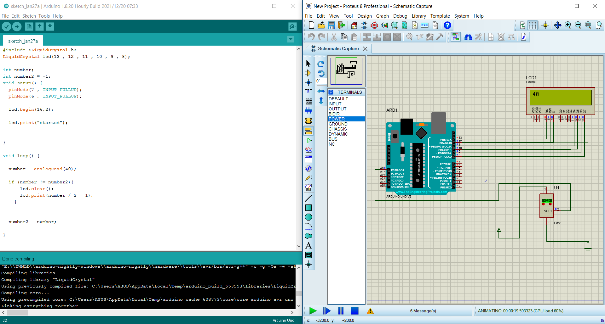
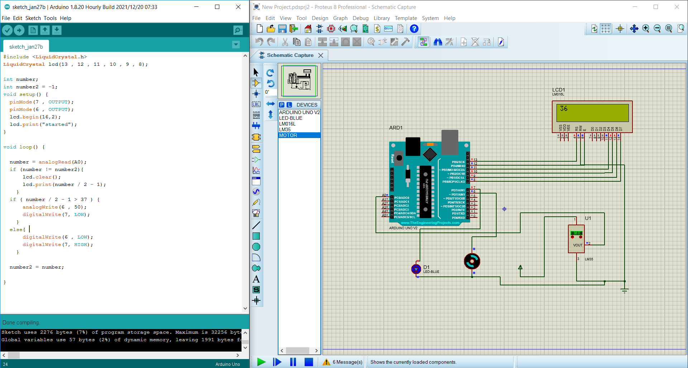
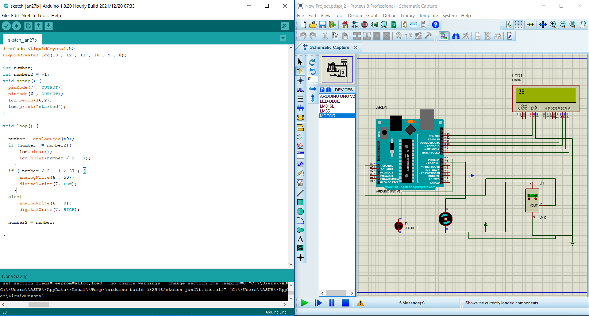
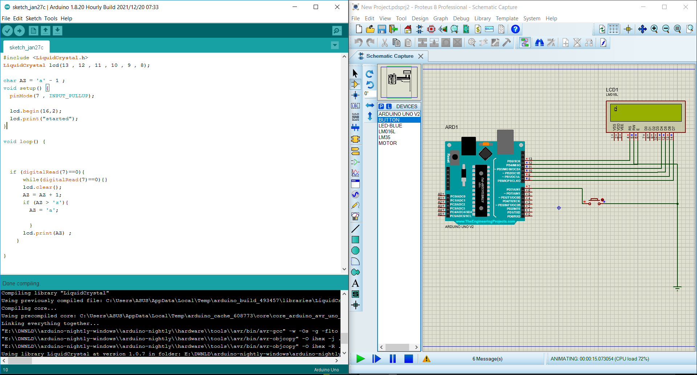
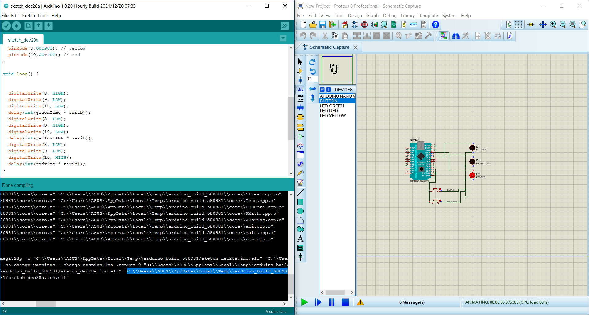
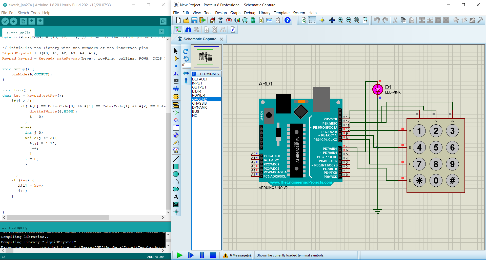

# Arduino Projects with Proteus 8

Welcome to a collection of Arduino projects simulated using Proteus 8. Each project demonstrates various functionalities and provides a glimpse into hardware and software interactions. Below are brief descriptions of each project along with pictures of their outputs.

## Project 1: Voltage Monitor

Components:
- Default
- Input
- Output
- Bidirectional
- Ground
- Chassis
- Dynamic
- Bus
- NC

## Project 2: Temperature Monitor

Components:
- Arduino Uno v2
- LED-BLUE
- LM016L LCD
- LM35 Temperature Sensor
- Motor

## Project 3: Motor Control

Components:
- Arduino Uno v2
- LED-BLUE
- LM016L LCD
- LM35 Temperature Sensor
- Motor

## Project 4: Traffic Light

Components:
- Arduino Uno v2
- Button
- LED-Green
- LED-Red
- LED-Yellow

## Project 5: Numeric Keypad

Components:
- Default
- Input
- Output
- Bidirectional
- Ground
- Chassis
- Dynamic
- Bus
- NC

Description:
This project is a light that turns on by entering the code "1378."
Please note that running this program requires the installation of the "keypad.h" library on your system.

## Usage

Each project folder contains the Arduino code and the corresponding Proteus simulation files for your reference.

## License

This project is licensed under the MIT license. For more information, please refer to the license file.

---

Feel free to explore the individual project folders, contribute to the projects, or adapt them to your specific Arduino and Proteus simulations!
